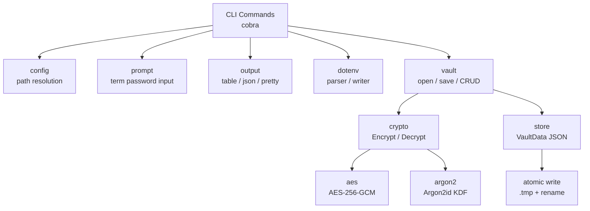

# vaultenv

[](https://go.dev)
[](LICENSE)
[](https://github.com/mdryaan/vaultenv/actions)
[](https://goreportcard.com/report/github.com/mdryaan/vaultenv)

> **A local 1Password for developer environment variables** — encrypt, manage, and export your secrets with one command.

---

## Features

- 🔐 **AES-256-GCM encryption** — industry-standard authenticated encryption
- 🔑 **Argon2id key derivation** — resistant to brute-force and GPU attacks
- 📝 **Full CRUD operations** — set, get, delete, list secrets by key
- 🏷️ **Tag-based organization** — group secrets by environment (production, staging, backend...)
- 📤 **Export to .env** — one command to generate a `.env` file for your project
- 📥 **Import from .env** — bulk-import existing secrets from `.env` files
- 🔄 **Password rotation** — re-encrypt the entire vault with a new master password
- 🎯 **Clipboard support** — copy secrets without printing, auto-clears after 30s
- 🎭 **Masked output** — show only last 4 chars (`****abcd`) by default
- 🤖 **CI/CD friendly** — use `VAULTENV_PASSWORD` env var for non-interactive use
- 🐚 **Shell completions** — bash, zsh, fish, and PowerShell
- 🎲 **Secret generation** — generate cryptographically random secrets with `--generate`

---

## Architecture



---

## Security

| Mechanism | Details |
|-----------|---------|
| **Encryption** | AES-256-GCM — authenticated encryption, detects tampering |
| **Key derivation** | Argon2id (time=3, memory=64MB, threads=4) — resists GPU/ASIC attacks |
| **Salt** | 16-byte cryptographically random salt, regenerated on every save |
| **Nonce** | 12-byte random GCM nonce, unique per encryption operation |
| **Atomic writes** | Write to `.tmp` then `os.Rename` — no partial writes on crash |
| **Memory safety** | Password bytes zeroed with `defer crypto.ZeroBytes(password)` |
| **No plaintext logs** | Secret values never appear in error messages or logs |
| **File permissions** | Vault written with mode `0600` — owner read/write only |

---

## Installation

### From source

```bash
git clone https://github.com/mdryaan/vaultenv.git
cd vaultenv
make install
```

### Using go install

```bash
go install github.com/mdryaan/vaultenv@latest
```

---

## Quick Start

```bash
# 1. Initialize your vault
vaultenv init

# 2. Store a secret
vaultenv set DATABASE_URL postgres://localhost:5432/myapp

# 3. Retrieve it
vaultenv get DATABASE_URL

# 4. List all secrets
vaultenv list

# 5. Export to .env file
vaultenv export --output .env
```

---

## Commands Reference

| Command | Description |
|---------|-------------|
| `vaultenv init` | Initialize a new encrypted vault |
| `vaultenv init --path ./my.enc` | Initialize at a custom path |
| `vaultenv set KEY VALUE` | Add or update a secret |
| `vaultenv set KEY` | Prompt for value securely |
| `vaultenv set KEY --generate` | Generate a random 32-byte hex secret |
| `vaultenv set KEY VALUE --tags prod,backend` | Tag a secret |
| `vaultenv get KEY` | Print secret value |
| `vaultenv get KEY --copy` | Copy to clipboard (clears in 30s) |
| `vaultenv get KEY --mask` | Print as `****1234` |
| `vaultenv delete KEY` | Remove a secret |
| `vaultenv delete KEY --force` | Remove without confirmation |
| `vaultenv list` | List all keys (values masked) |
| `vaultenv list --show-values` | List with full values |
| `vaultenv list --tags production` | Filter by tag |
| `vaultenv list --output json` | JSON output |
| `vaultenv export` | Print .env to stdout |
| `vaultenv export --output .env` | Write to file |
| `vaultenv export --tags production` | Export tagged secrets only |
| `vaultenv export --keys DB_URL,API_KEY` | Export specific keys |
| `vaultenv import .env` | Import from .env file |
| `vaultenv import .env --overwrite` | Overwrite existing keys |
| `vaultenv import .env --tags staging` | Tag imported secrets |
| `vaultenv import .env --dry-run` | Preview without changes |
| `vaultenv rotate` | Change master password |
| `vaultenv version` | Show version info |
| `vaultenv completion bash` | Generate bash completion |

---

## CI/CD Usage

For non-interactive environments, set these environment variables:

```bash
export VAULTENV_PATH=/secrets/vault.enc
export VAULTENV_PASSWORD=my-master-password

# Now all commands run without prompts
vaultenv export --output .env
vaultenv get DATABASE_URL
```

Example GitHub Actions step:

```yaml
- name: Export secrets
  env:
    VAULTENV_PATH: ${{ secrets.VAULT_PATH }}
    VAULTENV_PASSWORD: ${{ secrets.VAULT_PASSWORD }}
  run: vaultenv export --output .env
```

---

## Environment Variables

| Variable | Description |
|----------|-------------|
| `VAULTENV_PATH` | Override the default vault file path |
| `VAULTENV_PASSWORD` | Master password (for CI/CD, skips interactive prompt) |

**Path resolution order:**
1. `--vault` flag
2. `VAULTENV_PATH` environment variable
3. `~/.vaultenv/vault.enc` (default)

---

## Comparison

| Feature | vaultenv | direnv | dotenv | 1Password CLI |
|---------|----------|--------|--------|---------------|
| Local-first | ✅ | ✅ | ✅ | ❌ |
| Encrypted at rest | ✅ | ❌ | ❌ | ✅ |
| No cloud dependency | ✅ | ✅ | ✅ | ❌ |
| Tag-based filtering | ✅ | ❌ | ❌ | ✅ |
| Clipboard support | ✅ | ❌ | ❌ | ✅ |
| Shell completions | ✅ | ✅ | ❌ | ✅ |
| CI/CD friendly | ✅ | ✅ | ✅ | ✅ |
| Open source | ✅ | ✅ | ✅ | ❌ |
| Free | ✅ | ✅ | ✅ | ❌ |

---

## License

MIT — see [LICENSE](LICENSE)
